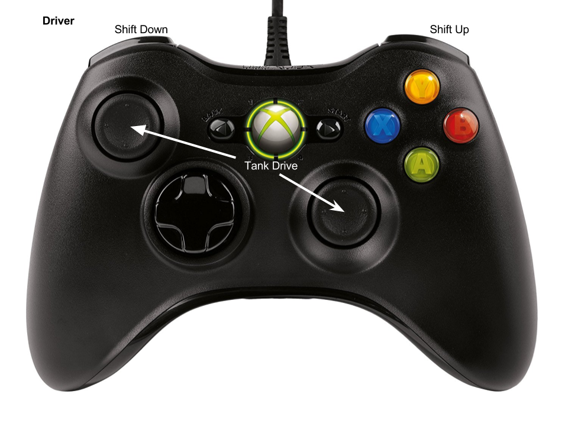
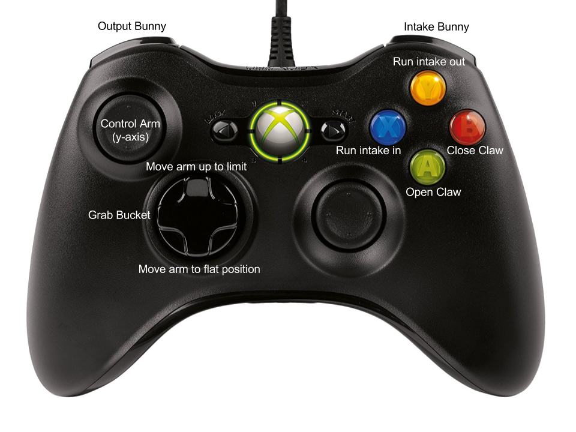

# bunnybots-kingbass-2017
Team 1540K (Kingbass) robot code for the 2017 BunnyBots game Hide and Seek. (Rules can be found [here](http://team1540.org/bunnybots/).)

## Bindings

### Driver
#### Diagram

* Joystick y-axes: Tank drive
* LB: Shift down
* RB: Shift up

### Copilot
#### Diagram

#### Arm
* Right stick Y: Raise/lower arm
* D-pad up: Move arm to upper limit (dump bucket)
* D-pad down: Move arm to flat position
* D-pad left: Grab bucket (close claw, move arm slightly up but don't dump it out)

#### Intake
* X button: Run intake in (while held)
* Y button: Run intake out (while held)
* Left bumper: Output bunny (briefly run intake out)
* Right bumper: Intake bunny (auto-stops after grabbing bunny or after 5 seconds)

#### Claw
* A button: Open claw
* B button: Close claw
